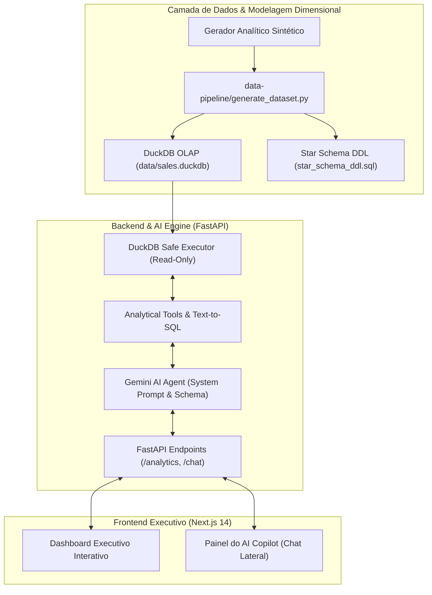

# 📊 Sales BI & AI Copilot

[](https://python.org)
[](https://fastapi.tiangolo.com)
[](https://duckdb.org)
[](https://nextjs.org)
[](https://ai.google.dev)
[](https://typescriptlang.org)
[](https://tailwindcss.com)
[](LICENSE)

> Plataforma analítica executiva de **Business Intelligence Comercial & Vendas** integrada a um **Copilot de Inteligência Artificial Conversacional (Google Gemini)** alimentado diretamente por um motor analítico colunar **DuckDB**.

---

## 🎯 Visão Geral do Projeto

Este repositório apresenta uma solução corporativa completa de **Modern Data Stack & Analytics Engineering**:

1. **Modelagem Dimensional Star Schema (Kimball):** Tabela Fato `f_vendas` conectada a 4 tabelas de dimensão (`d_calendario`, `d_produtos`, `d_vendedores`, `d_clientes`, `d_canais`) e `f_metas` orçadas.
2. **Motor Analítico Colunar DuckDB:** Processamento OLAP em memória capaz de executar cálculos de agregações, Curva ABC Pareto e rankings em menos de 15ms.
3. **Agente de IA Conversacional (Text-to-SQL + Business Analyst):** Assistente executivo integrado ao **Google Gemini 2.0 Flash** que traduz linguagem natural em queries SQL executadas com precisão na base de dados, prevenindo alucinações.
4. **Dashboard Executivo Customizado (Next.js 14):** Interface moderna com KPIs de faturamento líquido, margem de contribuição, funil de vendas B2B, curva ABC (Pareto 80/20) e leaderboard de quota por vendedor.
5. **Auditoria & Transparência Técnica:** O Copilot exibe as queries SQL executadas e o tempo de resposta em milissegundos, garantindo governança e confiabilidade para a diretoria.

---

## 🏛️ Arquitetura da Solução



---

## 📐 Modelo Dimensional (Star Schema)

| Tabela | Tipo | Descrição |
|---|---|---|
| `f_vendas` | **Fato** | Transações de pedidos com faturamento líquido, custo, descontos e margem de contribuição |
| `f_metas` | **Fato** | Metas orçadas mensais por vendedor e canal comercial |
| `d_calendario` | **Dimensão** | Granularidade diária com ano, mês, trimestre, semestre e dia útil |
| `d_produtos` | **Dimensão** | SKUs, categorias, preços de tabela, custos e classificação ABC |
| `d_vendedores` | **Dimensão** | Representantes comerciais, regionais, cargos e admissão |
| `d_clientes` | **Dimensão** | Contas B2B, segmentos de mercado, portes e estados |
| `d_canais` | **Dimensão** | Canais de venda (B2B Enterprise, E-commerce, Parceiros, Key Accounts) |

---

## 🤖 Como Funciona o AI Copilot

O assistente de IA utiliza uma arquitetura **Text-to-SQL com Síntese Executiva**:
1. O usuário envia uma pergunta de negócio (ex: *"Quem é o vendedor com maior faturamento no Sudeste?"*).
2. O agente recebe o contexto do schema relacional e gera uma consulta SQL analítica restrita a operações de leitura (`SELECT`/`WITH`).
3. O backend executa a query no **DuckDB** de forma isolada e segura.
4. O **Google Gemini** interpreta os dados retornados e sintetiza uma resposta executiva com insights práticos e formatação monetária padrão BRL.
5. A interface exibe a resposta acompanhada do **código SQL executado** e da telemetria de tempo de execução.

---

## 📁 Estrutura do Repositório

```text
sales-bi-ai-copilot/
├── backend/                  # API REST em FastAPI + DuckDB + Agente Gemini
│   ├── app/
│   │   ├── agent/            # Motor do Agente de IA (prompts e Text-to-SQL)
│   │   ├── api/              # Endpoints REST de Analytics e Chat
│   │   ├── core/             # Configurações com Pydantic-Settings
│   │   ├── db/               # Sessão DuckDB e Introspecção de Schema
│   │   └── main.py           # Ponto de entrada da aplicação FastAPI
│   ├── requirements.txt
│   └── README.md
├── data/
│   └── sales.duckdb          # Banco de dados colunar local DuckDB (13.7k+ registros)
├── data-pipeline/            # Scripts ETL & Modelagem Dimensional
│   ├── generate_dataset.py   # Gerador de dados analíticos com regras de negócio
│   ├── star_schema_ddl.sql   # DDL SQL completo das tabelas fato e dimensões
│   └── kpis_and_sql_metrics.md # Catálogo de KPIs e consultas analíticas
├── frontend/                 # Aplicação Executiva em Next.js 14
│   ├── app/                  # Rotas e páginas (App Router)
│   ├── components/
│   │   ├── chat/             # Painel lateral do AI Copilot e inspetor SQL
│   │   └── dashboard/        # Gráficos (Recharts), KPIs, Curva ABC e Leaderboard
│   ├── lib/                  # Clientes de API e formatadores
│   ├── package.json
│   └── README.md
├── .gitignore
├── LICENSE                   # Licença MIT
└── README.md
```

---

## 🚀 Como Executar o Projeto Localmente

### 1. Clonar o Repositório
```bash
git clone https://github.com/Renanbritto/sales-bi-ai-copilot.git
cd sales-bi-ai-copilot
```

### 2. Backend (FastAPI + DuckDB)
```bash
cd backend
python -m venv .venv
source .venv/bin/activate  # Linux/Mac ou no Windows: .\.venv\Scriptsctivate
pip install -r requirements.txt

# Configurar chave do Gemini no arquivo .env
cp .env.example .env

# Executar a API
uvicorn app.main:app --reload --port 8000
```
> Documentação interativa Swagger disponível em: `http://localhost:8000/docs`

### 3. Frontend (Next.js 14)
```bash
cd ../frontend
npm install
npm run dev
```
> Acesse o Dashboard em: `http://localhost:3000`

---

## 🌿 Estrutura de Branches (GitFlow)

O projeto segue as melhores práticas de versionamento com branches estruturadas:
* `main`: Código de produção e versões estáveis marcadas com tags.
* `develop`: Branch de integração contínua.
* `feature/data-pipeline-star-schema`: Modelagem Star Schema, DuckDB e catálogo de métricas.
* `feature/backend-fastapi-gemini-agent`: API FastAPI, motor DuckDB e Agente Gemini.
* `feature/frontend-nextjs-copilot`: Interface em Next.js com dashboard e Copilot lateral.
* `release/v1.0.0`: Consolidação e homologação da versão inicial.

---

## 👨‍💻 Autor

**Renan Nocelli Britto**
* Portfólio Profissional: [renan-nocelli.vercel.app](https://renan-nocelli.vercel.app)
* GitHub: [@Renanbritto](https://github.com/Renanbritto)
* LinkedIn: [linkedin.com/in/renan-nocelli](https://linkedin.com/in/renan-nocelli)
